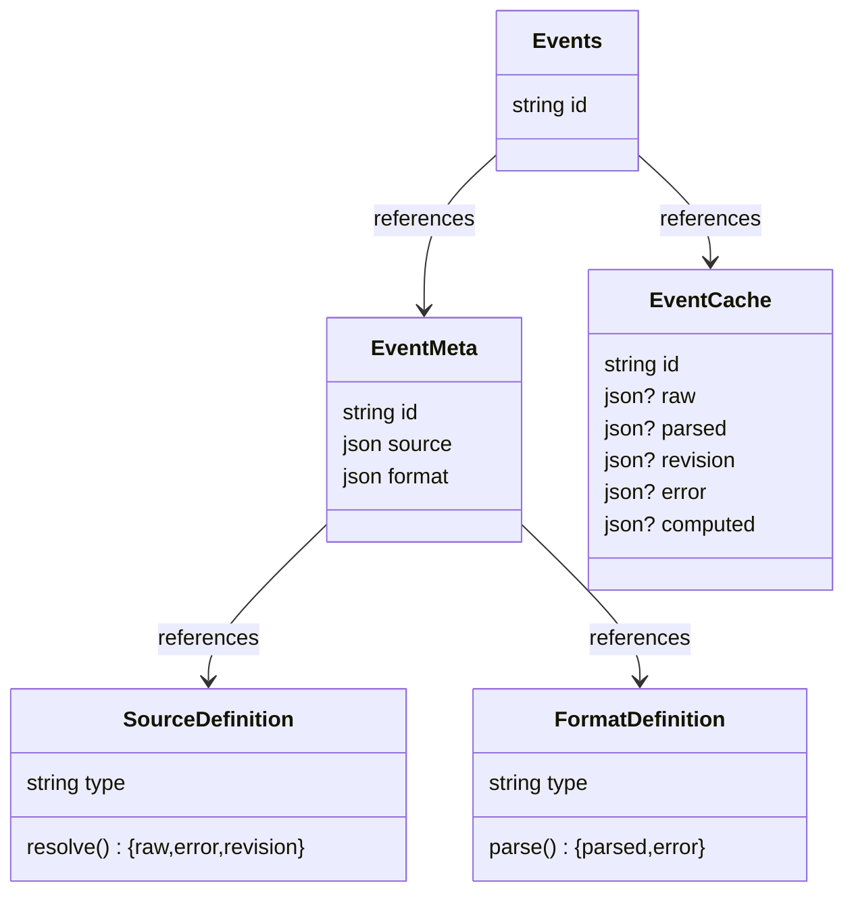
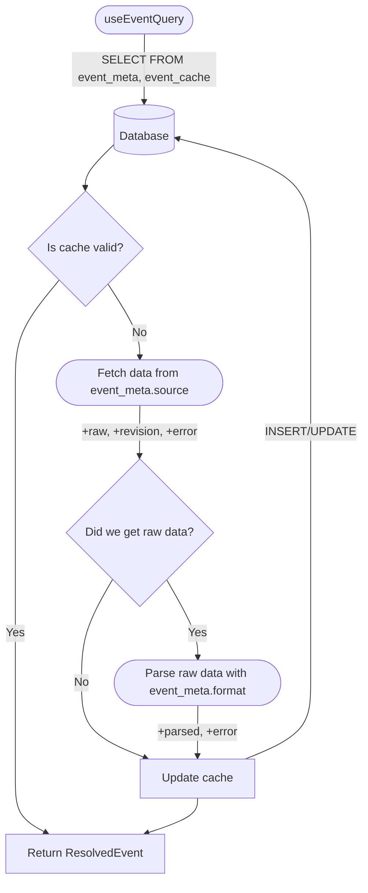

# Vantage

A reference web application for viewing events.

This application is built using React, Mantine, Zustand, Jotai, Tanstack Query and Router, SQLocal, Drizzle ORM and more.

This is a monorepo managed with pnpm, and consists of the following packages:

- `packages/app-web`: The web application, built with React and Mantine.
- `packages/core`: The core library, which contains the main logic for fetching, parsing and caching event data, as well as some utilities and types. It holds the drizzle database instance and the query client.
- `packages/db`: The database package, which contains the Drizzle ORM schema.

## For Developers

Special pages exist:

- `/embed` - iframe embeddable event card information.
  
  You must supply one of the following query parameters:
  - `source`: HTTP URL or AT URI
  - `event-data`: JSON string of OpenEvent data

- `/form` - render an event data editing form
  
  Query parameters:
  - Either `source` or `event-data` **required**, same as `/embed`
  - `redirect-to`: URL to redirect to after form submission; query parameters will be appended with the updated event data, e.g. `?data={"...`
  - `continue-text`: Text to show on the continue button (default: "Continue")
  - `title`: Title to show above the form (default: "Edit Event Data")
  - `desc`: Description to show above the form

## Diagram





## Development

- Go to [this link](https://eventsl.ink/?setInstanceUrl=http://127.0.0.1:5173) to set the instance URL for development 

```bash
cd apps/web
pnpm i
pnpm dev
```


